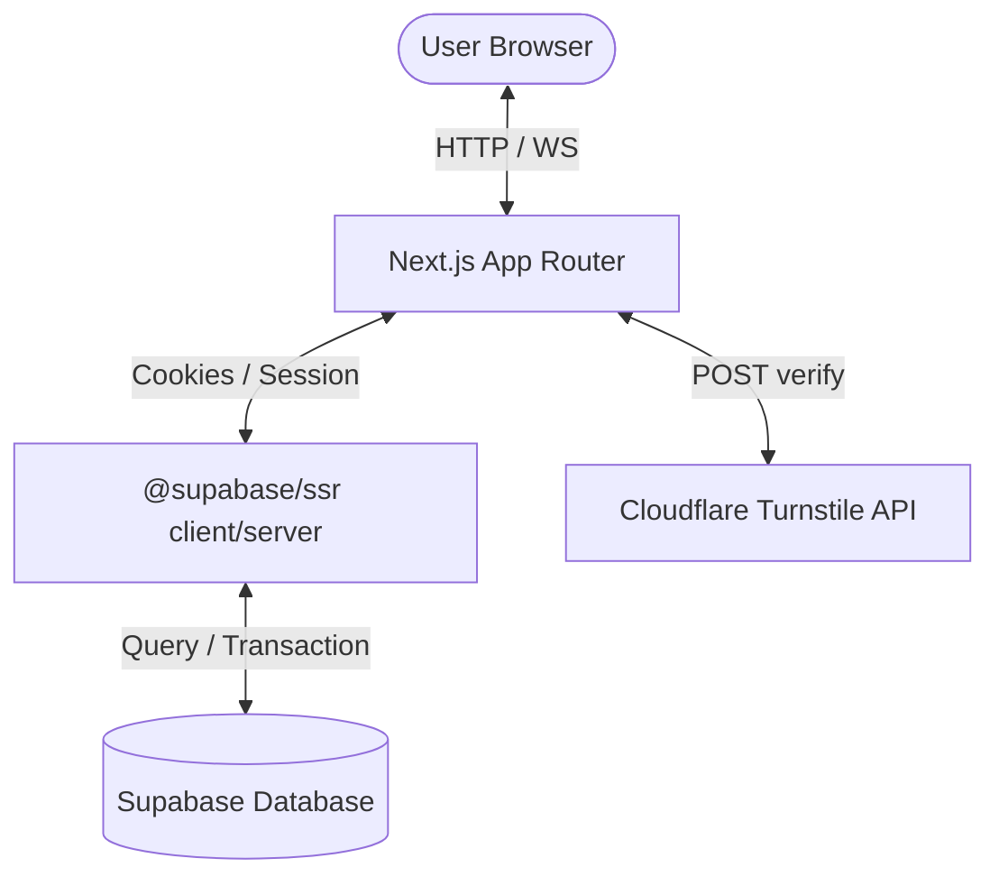

# Heapify Global Community Platform

A product-grade community operating system featuring event directories, challenges, open-source project hubs, leaderboards, internships, resources, chapters, and administrative panels. Built on **Next.js 15** and **Supabase**.

---

## Technical Architecture

The platform uses a hybrid server/client model to deliver speed, security, and real-time interaction:



### Key Subsystems

1. **Next.js 15 App Router**: Focuses on Server-First design using React Server Components (RSC) to handle page data queries directly in Node.js, combined with Client Components for dynamic slide drawers and forms.
2. **Supabase SSR**: Session management is cookie-driven. The middleware ([middleware.ts](file:///c:/Coding/heapify/middleware.ts)) refreshes expired auth tokens on the fly, while [server.ts](file:///c:/Coding/heapify/lib/supabase/server.ts) allows server-side pages to authenticate requests safely.
3. **Turnstile Captcha Verification**: Sign-up, Sign-in, and reset flows are secured with Cloudflare Turnstile token validation via internal APIs to prevent automated bot requests.
4. **Environment-Based Feature Flags**: To support clean releases, non-production features are filtered from navigation menus and landing screens on production builds.

---

## Environment Configuration

The application reads from the following environment variables:

| Variable | Description | Required in Prod |
|---|---|---|
| `NEXT_PUBLIC_SUPABASE_URL` | The endpoint URL of your Supabase project instance. | Yes |
| `NEXT_PUBLIC_SUPABASE_ANON_KEY` | Public anonymous API key for browser client queries. | Yes |
| `SUPABASE_SERVICE_ROLE_KEY` | Admin/Bypass RLS key. Keep secret; only queried in server APIs. | Yes |
| `NEXT_PUBLIC_TURNSTILE_SITE_KEY` | Turnstile public widget configuration key. | Yes |
| `TURNSTILE_SECRET_KEY` | Turnstile verification key. Keep secret; queried in server APIs. | Yes |
| `NEXT_PUBLIC_STAGE` | Set to `"production"` on production domains to hide stubs. | No (defaults to NODE_ENV) |

### Stage Toggles (Production vs. Staging/Dev)

In production environments (`process.env.NODE_ENV === "production"` or `NEXT_PUBLIC_STAGE === "production"`), the following incomplete/scaffolded pages and feature links are hidden from navigation menus, footers, and landing page CTA actions:
- **Dashboard** (`/dashboard`)
- **Challenges** (`/challenges`)
- **Projects / Open Source** (`/open-source`)
- **Resources** (`/resources`)

These pages remain fully accessible and visible in development environments (`npm run dev`) for testing.

---

## Core Flows

### 1. Event Registration Auth Redirect
- Event detail screens are cached via Incremental Static Regeneration (ISR).
- When a user clicks **Register**, the client component performs a browser auth check.
- Unauthenticated users are redirected to `/login?redirectTo=/events/[slug]?register=true`.
- After sign-in, the application redirects them back, automatically sliding open the registration form.

### 2. Forgot Password and Password Reset
- **Forgot Password**: Accessible from the Sign In card. Submitting sends a reset email via Supabase configured with the redirect callback URL:
  `redirectTo: ${location.origin}/auth/callback?next=/reset-password`
- **Session Exchange**: The callback route exchanges the single-use recovery code for an active session and redirects to the reset form.
- **Form Action**: The `/reset-password` page takes the new credentials and updates the session password using `supabase.auth.updateUser({ password })`.

---

## Getting Started

### Local Setup

1. Install dependencies:
   ```bash
   npm install
   ```
2. Copy sample configurations to local files:
   ```bash
   cp .env.example .env.local
   ```
3. Populate `.env.local` with your database and captcha keys.
4. Run the development server:
   ```bash
   npm run dev
   ```

### Supabase Database Migration

1. Create a fresh project in the Supabase Console.
2. Navigate to the SQL Editor and execute the schema script inside `supabase/schema.sql` to initialize tables, relationships, and RLS policies.
3. Configure authentication redirect parameters in the Supabase Dashboard under `Auth Settings -> Redirect URLs` to include:
   - `http://localhost:3000/auth/callback`
   - `https://your-domain.vercel.app/auth/callback`

---

## Development Standards

- **TypeScript Strictness**: `strict` is enabled. All parameter/return signatures must have explicit type declarations. Avoid using `any` type casting.
- **ESLint Configurations**: Conforms to `next/core-web-vitals` and `@typescript-eslint`. Verify changes before committing:
   ```bash
   npm run lint
   ```
- **Build Checks**: Ensure compilation bundles correctly before pushing changes:
   ```bash
   npm run build
   ```
