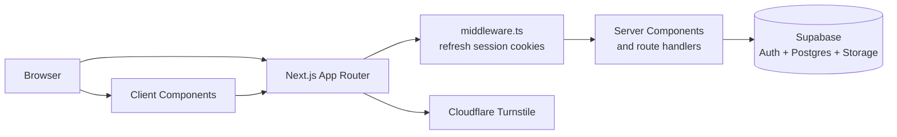

# Architecture overview

## Runtime shape

Heapify is a Next.js 15 App Router application. Most pages are server-rendered and query Supabase through the server client. Client Components are used where browser state or interaction is required, such as authentication forms, event registration, drawers, uploads, and theme behavior.

## Request and data boundaries

### Supabase clients

- `lib/supabase/server.ts` creates a cookie-backed server client using the public Supabase URL and anon key. Pages and route handlers use it to read the current session and query data under RLS.
- `lib/supabase/client.ts` creates the browser client for client-side auth checks and interactive flows.
- `lib/supabase/admin.ts` exposes a service-role client only when `SUPABASE_SERVICE_ROLE_KEY` is configured. Treat this client as server-only; it bypasses RLS.
- `middleware.ts` refreshes the Supabase session by reading and writing auth cookies. It does not replace page-level authorization checks.

### Pages and query helpers

Read-heavy server behavior is centralized in `lib/supabase/queries.ts`. Helpers return Supabase's `{ data, error }` result so callers can decide how to render failures. Route pages under `app/` compose those reads into the UI.

The root layout loads the current session and determines whether the user leads a chapter so the navigation can expose chapter controls. Role-sensitive pages should use `requireRole` from `lib/auth/authorization.ts`.

### API routes

- `POST /api/captcha` validates a Turnstile token server-side through Cloudflare's Siteverify endpoint.
- `POST /api/events/[slug]/register` authenticates the caller, loads event rules, validates the payload, determines `registered` versus `waitlisted`, and inserts through the user's RLS-bound Supabase client.
- `POST /api/forms/contact` handles contact form submissions.
- `/auth/callback` exchanges the Supabase auth code and redirects to the requested safe destination.

## Rendering and caching

The event detail page (`app/events/[slug]/page.tsx`) uses `revalidate = 60`, so public event content may be up to one minute stale. Registration counts and the registration form configuration are loaded as part of the page request. Registration itself is handled by the API route and must not depend on cached page output.

The event detail interaction is intentionally split by viewport: mobile conditionally renders the detail or form; desktop slides between them using CSS transforms. Keep layout animation changes inside `components/events/EventDetailClient.tsx` deliberate because the implementation avoids animating box-model properties.

## Authentication and authorization

Authentication is handled by Supabase Auth. The application uses the browser client for immediate UI checks, but security decisions are enforced server-side:

1. The registration route calls `supabase.auth.getUser()` and rejects unauthenticated requests.
2. The database RLS policy requires `auth.uid() = user_id` for registration writes.
3. Role-protected pages call `requireRole`, which checks the authenticated user's `profiles.role`.
4. Turnstile reduces automated auth abuse; it is CAPTCHA verification, not a general request rate limiter.

Never send the service-role key to a Client Component or expose it as a `NEXT_PUBLIC_` variable.
