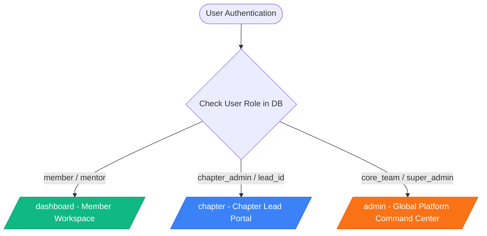
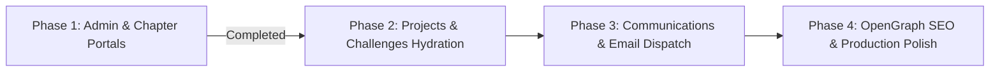

# 🌐 Heapify Global Community Platform — Status & Roadmap

> [!NOTE]
> This document serves as the live status report, structural breakdown, and execution roadmap for developers and AI agents working on the **Heapify Global Community Platform** repository.

---

## 1. 📍 Current Branch Context (`develop`)

The local `develop` branch is fully synchronized with `origin/develop` (`b655c82`).

> [!TIP]
> **Build Verification**: Run `npx tsc --noEmit` anytime to verify strict TypeScript compilation. The current build passes with **0 errors**.

### Recent Core Enhancements
* **Events Subsystem & Dynamic Status**:
  * Integrated multi-temporal query helper `getEvents()` in [`queries.ts`](file:///c:/Coding/heapify/lib/supabase/queries.ts) fetching both active/upcoming and past events.
  * Added `computeEventStatus` for 3-state temporal sorting (**Upcoming**, **Ongoing**, **Completed/Cancelled**).
  * Equal-height flexbox card grid layouts (`flex-1`).
* **Partner & Collaborator Ecosystem**:
  * Added local vector assets under [`public/partners/`](file:///c:/Coding/heapify/public/partners/) (RedBull, GDG, Gemma, Devfolio, IEEE, MSRIT, Nexus, Kaggle, etc.).
  * Interactive SVG collaborator grid component [`CollaborationsField`](file:///c:/Coding/heapify/components/site/collaborations-field.tsx).

---

## 2. 📊 Subsystem & Feature Audit Matrix

| Subsystem / Feature | Route / File Path | Status | Operational Notes |
| :--- | :--- | :---: | :--- |
| **Landing Page** | [`app/page.tsx`](file:///c:/Coding/heapify/app/page.tsx) | 🟢 `COMPLETE` | Hero, Live Community Stats, What We Do, Spotlight Event, Announcements, Collaborator Grid. |
| **Events Directory** | [`app/events/page.tsx`](file:///c:/Coding/heapify/app/events/page.tsx) | 🟢 `HYDRATED` | ISR (60s revalidation), DB-driven, dynamic category filters, active vs. past split. |
| **Flagship Event Showcase** | [`app/events/build-with-gemma`](file:///c:/Coding/heapify/app/events/build-with-gemma/page.tsx) | 🟢 `COMPLETE` | Retrospective showcase for Bengaluru AI Sprint (keynote, photos, speaker highlights). |
| **Event Detail & Registration** | [`app/events/[slug]/page.tsx`](file:///c:/Coding/heapify/app/events/[slug]/page.tsx) | 🟢 `HYDRATED` | Dynamic event fetch, Turnstile CAPTCHA verification, attendee CSV export. |
| **About Us & Timeline** | [`app/about/page.tsx`](file:///c:/Coding/heapify/app/about/page.tsx) | 🟢 `COMPLETE` | Mission, vision, core values, interactive Framer Motion scroll timeline. |
| **Team Roster** | [`app/team/page.tsx`](file:///c:/Coding/heapify/app/team/page.tsx) | 🟢 `COMPLETE` | Categorized team roster with social handles. |
| **Global Chapters** | [`app/chapters/page.tsx`](file:///c:/Coding/heapify/app/chapters/page.tsx) | 🟢 `HYDRATED` | Bento grid layout; fetches `chapters` table via `getChapters()` with static fallback. |
| **Member Dashboard** | [`app/dashboard/page.tsx`](file:///c:/Coding/heapify/app/dashboard/page.tsx) | 🟢 `HYDRATED` | Session-protected workspace; score, badges, event registration history, role shortcuts. |
| **Platform Command Center** | [`app/admin/page.tsx`](file:///c:/Coding/heapify/app/admin/page.tsx) | 🟢 `PROTECTED` | Access restricted (`core_team`, `super_admin`); live metrics, events catalog, submissions inbox. |
| **Chapter Lead Portal** | [`app/chapter/page.tsx`](file:///c:/Coding/heapify/app/chapter/page.tsx) | 🟢 `PROTECTED` | Access restricted (`lead_id`, `chapter_admin`, global admin fallback); roster & events manager. |
| **Challenges & Bounties** | [`app/challenges/page.tsx`](file:///c:/Coding/heapify/app/challenges/page.tsx) | 🟡 `GATED` | UI ready; gated via `NEXT_PUBLIC_STAGE` until submission backend complete. |
| **Open Source Projects Hub** | [`app/open-source/page.tsx`](file:///c:/Coding/heapify/app/open-source/page.tsx) | 🟡 `GATED` | UI ready; gated via `NEXT_PUBLIC_STAGE` until `projects` table hydration complete. |
| **Learning Resources** | [`app/resources/page.tsx`](file:///c:/Coding/heapify/app/resources/page.tsx) | 🟡 `GATED` | Framework ready; gated via `NEXT_PUBLIC_STAGE`. |
| **Forms Engine** | [`app/forms/[type]/page.tsx`](file:///c:/Coding/heapify/app/forms/[type]/page.tsx) | 🟢 `FUNCTIONAL` | Dynamic form renderer (`join`, `contact`, `chapter_lead`, `sponsor`) saved to admin inbox. |

---

## 3. 🛡️ Role-Based Access Control (RBAC) Architecture



> [!IMPORTANT]
> **Role Enforcement Mechanisms**:
> 1. **Database Layer**: Role stored in PostgreSQL `profiles.role` (`user_role` enum: `'member'`, `'mentor'`, `'chapter_admin'`, `'core_team'`, `'super_admin'`).
> 2. **Server-Side Helper**: `requireRole(['core_team', 'super_admin'])` in [`authorization.ts`](file:///c:/Coding/heapify/lib/auth/authorization.ts) redirects unauthorized users to `/` or `/dashboard`.

---

## 4. 🗺️ Strategic Roadmap & Next Phases



### ⚡ Phase 2: Open Source Hub & Challenges Integration
- Connect [`app/open-source/page.tsx`](file:///c:/Coding/heapify/app/open-source/page.tsx) to `projects` table in Supabase.
- Integrate GitHub API for star counts, open issues, and top contributors.
- Connect [`app/challenges/page.tsx`](file:///c:/Coding/heapify/app/challenges/page.tsx) to `challenges` and `challenge_submissions` tables.

### 📧 Phase 3: Email Notifications & Automation
- Integrate Resend API for transactional emails:
  * Instant auto-reply on form submissions (`/forms/[type]`).
  * Event registration confirmation with calendar invite attachment.

### 🛡️ Phase 4: OpenGraph SEO & Developer Tooling
- Dynamic OpenGraph preview generation via `@vercel/og` for `/events/[slug]`.
- Provide complete `supabase/seed.sql` for instant local development setup.

---

## 5. 📦 Incremental Feature Commit Guide

When committing your work feature-by-feature, use the following concise commit conventions:

### Feature 1: Chapters Page Hydration
```bash
git add app/chapters/page.tsx lib/supabase/queries.ts
git commit -m "feat(chapters): dynamic DB hydration with static fallback"
```

### Feature 2: Member Dashboard
```bash
git add app/dashboard/page.tsx
git commit -m "feat(dashboard): full dynamic hydration for profile, registered events, and badges"
```

### Feature 3: Admin Panel Command Center
```bash
git add app/admin/
git commit -m "feat(admin): admin dashboard for event management and form submissions"
```

### Feature 4: Chapter Lead Portal
```bash
git add app/chapter/page.tsx
git commit -m "feat(chapter): chapter lead portal for managing local events and stats"
```

### Feature 5: Project Documentation & Roadmap
```bash
git add .gitignore SITE_STRUCTURE.md repo_status_and_roadmap.md
git commit -m "docs: update site structure and project roadmap status"
```
