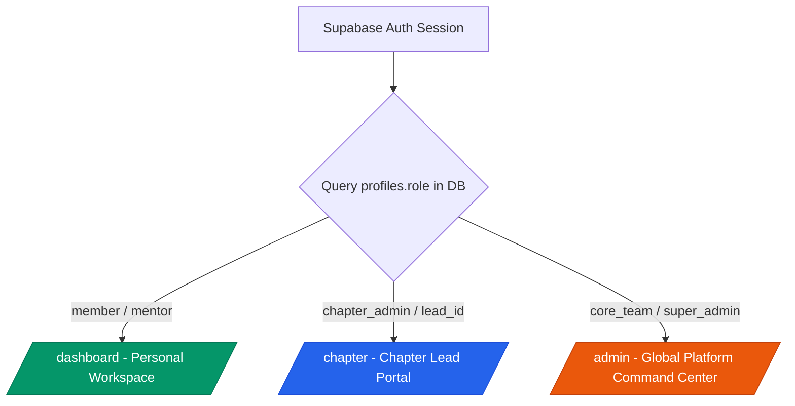
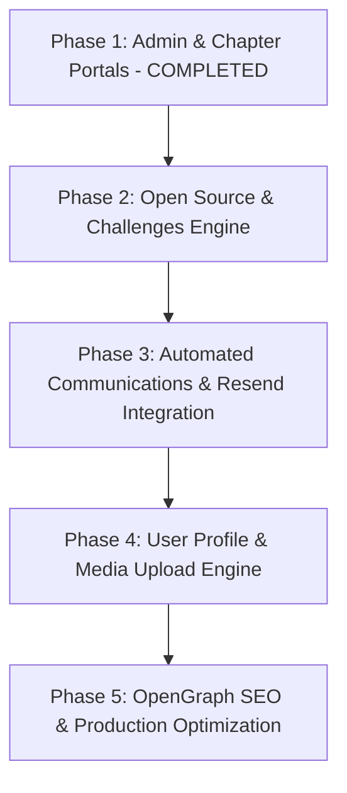

# 🌐 Heapify Global Community Platform — Status & Architectural Roadmap

> [!NOTE]
> This document serves as the authoritative status report, component matrix, and prioritized technical roadmap for the **Heapify Global Community Platform** repository.

---

## 1. 📍 Platform Architecture & Branch Status

The repository is built on **Next.js 15 (App Router)**, **Supabase (PostgreSQL, RLS, `@supabase/ssr`)**, and **TailwindCSS with Framer Motion**.

* **Branch Alignment**: Synchronized with `origin/develop`.
* **Type Safety & Build Status**: Strict TypeScript compilation (`npx tsc --noEmit`) passes cleanly with **0 errors**.
* **Stage Controls**: Scaffolded modules are safely gated in production using `NEXT_PUBLIC_STAGE` environment flags.

---

## 2. 📊 Component & Feature Matrix

| Subsystem / Feature | Route / Target File | Operational Status | Technical Overview |
| :--- | :--- | :---: | :--- |
| **Landing Page** | [`app/page.tsx`](file:///c:/Coding/heapify/app/page.tsx) | 🟢 `PRODUCTION READY` | Hero, live community metrics (`site_stats`), Spotlight event, announcements, partner grid. |
| **Events Explorer** | [`app/events/page.tsx`](file:///c:/Coding/heapify/app/events/page.tsx) | 🟢 `HYDRATED` | ISR (60s revalidation), DB-driven multi-temporal sorting (Active vs. Past), category filtering. |
| **Flagship Retrospective** | [`app/events/build-with-gemma`](file:///c:/Coding/heapify/app/events/build-with-gemma/page.tsx) | 🟢 `PRODUCTION READY` | Dedicated showcase for Bengaluru AI Sprint (keynotes, photo gallery, partner highlights). |
| **Event Registration & Detail** | [`app/events/[slug]/page.tsx`](file:///c:/Coding/heapify/app/events/[slug]/page.tsx) | 🟢 `HYDRATED` | Dynamic event server component, Turnstile CAPTCHA verification, attendee CSV exports. |
| **About Us & Timeline** | [`app/about/page.tsx`](file:///c:/Coding/heapify/app/about/page.tsx) | 🟢 `PRODUCTION READY` | Mission, vision, core values, interactive Framer Motion vertical timeline. |
| **Team Roster** | [`app/team/page.tsx`](file:///c:/Coding/heapify/app/team/page.tsx) | 🟢 `PRODUCTION READY` | Categorized directory of founders, tech leads, and community administrators. |
| **Global Chapters Directory** | [`app/chapters/page.tsx`](file:///c:/Coding/heapify/app/chapters/page.tsx) | 🟢 `HYDRATED` | BentoGrid layout; dynamically fetches `chapters` table via `getChapters()` with static fallback. |
| **Member Workspace** | [`app/dashboard/page.tsx`](file:///c:/Coding/heapify/app/dashboard/page.tsx) | 🟢 `HYDRATED` | Session-protected workspace; score, badges, event registration history, role shortcuts. |
| **Platform Command Center** | [`app/admin/page.tsx`](file:///c:/Coding/heapify/app/admin/page.tsx) | 🟢 `PROTECTED` | Access restricted (`core_team`, `super_admin`); live metrics, events catalog, submissions inbox. |
| **Chapter Lead Portal** | [`app/chapter/page.tsx`](file:///c:/Coding/heapify/app/chapter/page.tsx) | 🟢 `PROTECTED` | Access restricted (`lead_id`, `chapter_admin`, global admin fallback); roster & events manager. |
| **Open Source Projects Hub** | [`app/open-source/page.tsx`](file:///c:/Coding/heapify/app/open-source/page.tsx) | 🟡 `DEVELOPMENT GATED` | Component grid UI ready; pending dynamic hydration from `projects` table. |
| **Challenges & Bounties** | [`app/challenges/page.tsx`](file:///c:/Coding/heapify/app/challenges/page.tsx) | 🟡 `DEVELOPMENT GATED` | Component framework ready; pending dynamic hydration from `challenges` table. |
| **Learning Resources Hub** | [`app/resources/page.tsx`](file:///c:/Coding/heapify/app/resources/page.tsx) | 🟡 `DEVELOPMENT GATED` | Framework layout ready; pending content catalog hydration. |
| **Dynamic Forms Engine** | [`app/forms/[type]/page.tsx`](file:///c:/Coding/heapify/app/forms/[type]/page.tsx) | 🟢 `FUNCTIONAL` | Dynamic form handler (`join`, `contact`, `chapter_lead`, `sponsor`) saved to admin inbox. |

---

## 3. 🛡️ Access Control & Security Model

> [!IMPORTANT]
> **Authorization & RLS Standards**:
> 1. **Database Role Enforcement**: PostgreSQL `profiles.role` enum (`member`, `mentor`, `chapter_admin`, `core_team`, `super_admin`).
> 2. **Application Server Security**: Server-side role checks via `requireRole(['core_team', 'super_admin'])` in [`authorization.ts`](file:///c:/Coding/heapify/lib/auth/authorization.ts) prevent unauthorized route navigation.

---

## 4. 🎯 Prioritized Technical Roadmap

### 🔴 High Priority: Open Source & Challenges Engine (Phase 2)
1. **Open Source Projects Directory (`/open-source`)**:
   - Hydrate project cards dynamically from Supabase `projects` table (`getProjects()`).
   - Integrate GitHub REST/GraphQL API to display live repository star counts, open issues, and primary tech stack tags.
   - Implement "Join as Contributor" action inserting into `project_contributors`.
2. **Challenges & Bounties Engine (`/challenges`)**:
   - Hydrate active vs. past challenges dynamically using `getActiveChallenges()` and `getPastChallenges()`.
   - Build challenge submission modal with repo URL validation and CAPTCHA protection (`challenge_submissions`).
   - Implement winner showcase displaying winner profile badges (`user_badges`).

### 🟠 Medium Priority: Automated Email & Communication Dispatch (Phase 3)
1. **Transactional Email Service**:
   - Integrate Resend SDK (`resend`) into Next.js Server Actions.
   - Dispatch branded HTML auto-replies upon form submission (`/forms/join`, `/forms/contact`, `/forms/chapter_lead`, `/forms/sponsor`).
2. **Event Registration Receipts**:
   - Send confirmation emails with `.ics` calendar invites upon event registration.

### 🟡 Medium Priority: User Profile & Media Upload Engine (Phase 4)
1. **Profile Editor (`/profile/edit`)**:
   - Connect profile update form to `profiles` table (bio, GitHub, LinkedIn, Twitter, personal website).
   - Implement avatar image upload with direct integration to Supabase Storage bucket (`avatars`).

### 🟢 Low Priority: SEO, OpenGraph & Developer Experience (Phase 5)
1. **Dynamic OpenGraph Previews**:
   - Implement `@vercel/og` image generation for social previews on `/events/[slug]` and `/open-source/[slug]`.
2. **Standardized Database Seed Script**:
   - Provide structured SQL seed script (`supabase/seed.sql`) enabling instant local database setup for new contributors.
